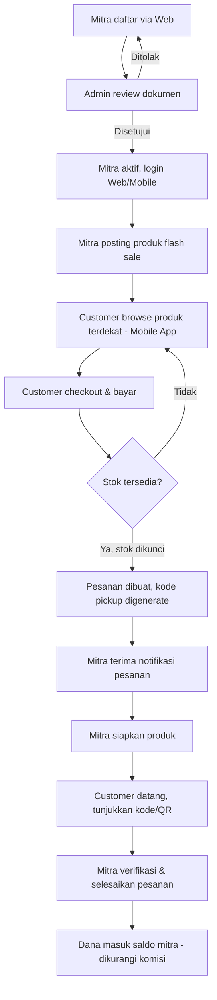
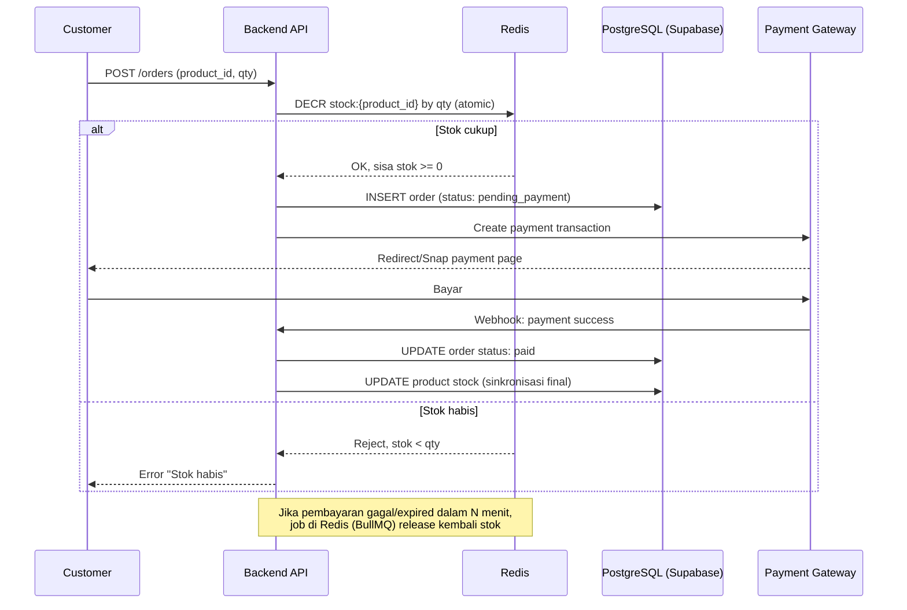
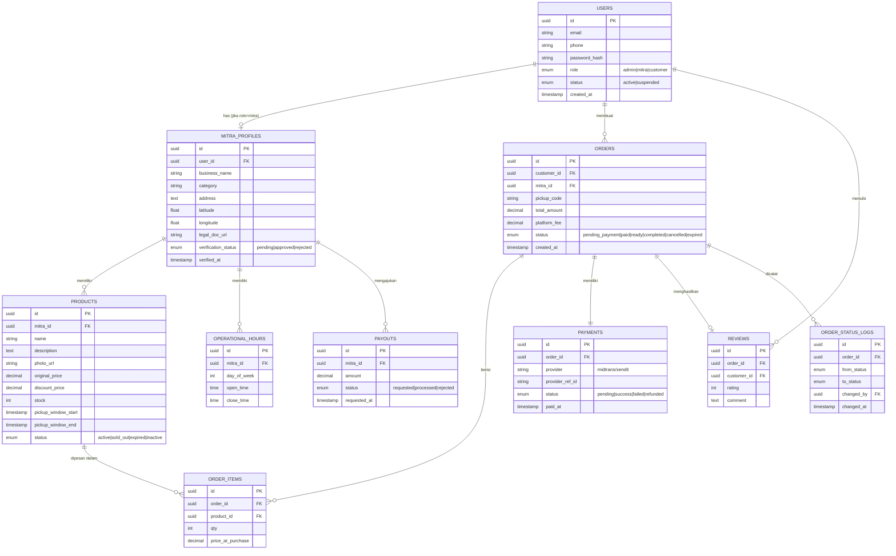
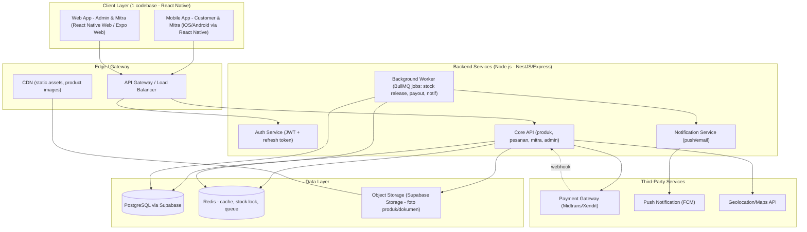

# SAFO — Software Requirement Specification & Arsitektur Sistem

**Tagline:** Menjembatani mitra usaha kuliner dan masyarakat untuk mengurangi food waste lewat flash sale makanan surplus.

**Versi Dokumen:** 1.0
**Disusun untuk:** Perencanaan teknis awal (pre-development)
**Referensi kompetitor:** Too Good To Go, Surplus.id, Happy Hour App (untuk model surplus food), diadaptasi dengan pola operasional ShopeeFood/GoFood untuk sisi mitra & pesanan

---

## 1. Ringkasan Eksekutif

Safo adalah platform dua sisi (*two-sided marketplace*) yang mempertemukan mitra (UMKM, kafe, resto) yang memiliki potensi makanan tidak terjual di akhir jam operasional, dengan konsumen yang ingin membeli makanan tersebut dengan harga lebih murah. Model bisnis ini dikenal sebagai *surplus food marketplace*.

Berbeda dengan ShopeeFood/GoFood yang berbasis on-demand delivery untuk makanan reguler, Safo berbasis **flash sale dengan stok terbatas dan window waktu tertentu** (mirip Too Good To Go — konsumen membeli "paket kejutan" atau produk spesifik, lalu ambil/pickup sendiri atau diantar dalam window waktu tertentu). Ini penting karena **memengaruhi arsitektur** — sistem harus tahan terhadap *race condition* saat banyak orang berebut stok terbatas di waktu bersamaan.

---

## 2. Tujuan & Ruang Lingkup

### 2.1 Tujuan Bisnis
- Mengurangi food waste dari mitra usaha kuliner.
- Memberi mitra kanal tambahan monetisasi atas produk yang berisiko terbuang.
- Memberi konsumen akses makanan berkualitas dengan harga lebih terjangkau.

### 2.2 Tujuan Teknis (untuk dokumen ini)
- Menetapkan kebutuhan fungsional & non-fungsional secara terstruktur (SRS).
- Menetapkan skema data dan arsitektur backend yang scalable untuk fase MVP → growth.
- Menjadi acuan bersama tim (meski saat ini kamu solo/junior engineer) agar keputusan teknis konsisten.

### 2.3 Di Luar Ruang Lingkup MVP
- Sistem pengantaran (kurir) — asumsi awal: model **self pickup** oleh konsumen ke lokasi mitra (sesuai pola Too Good To Go/Surplus.id, bukan GoFood/ShopeeFood yang delivery).
- Multi-currency / multi-negara.
- Sistem rekomendasi berbasis ML (bisa masuk fase 2).

> **Catatan penting:** Dokumen ini mengasumsikan model **pickup**, karena tidak disebutkan kurir/delivery di actor & fitur yang kamu tulis. Jika ternyata kamu ingin ada delivery, ini akan menambah actor baru (kurir) dan mengubah arsitektur pesanan secara signifikan — beri tahu saya kalau begitu, karena ini keputusan yang sebaiknya difinalisasi di awal, bukan di tengah jalan.

---

## 3. Aktor & Peran (Role-Based Access)

| Aktor | Deskripsi | Kanal Akses |
|---|---|---|
| **Admin** | Mengawasi transaksi, verifikasi mitra, mengatur business rule, manajemen user | Web only |
| **Mitra** | UMKM/kafe yang menjual produk surplus | Web (pendaftaran, manajemen awal) + Mobile (operasional harian) |
| **Customer** | Pembeli produk flash sale | Mobile only |

**Catatan desain:** karena mitra butuh akses web (pendaftaran & dashboard) **dan** mobile (posting produk cepat, notifikasi pesanan real-time), sedangkan admin murni web, dan customer murni mobile — ini justru **memperkuat alasan pemilihan React Native + React Native Web**, karena kamu bisa share codebase komponen antara dashboard mitra versi web dan versi mobile, sementara panel admin bisa jadi web app terpisah (atau tetap 1 codebase, beda routing berdasarkan role).

---

## 4. Functional Requirements (SRS)

Format: `FR-[MODUL]-[NOMOR]` | Prioritas: **Must** (MVP wajib) / **Should** (penting tapi bisa menyusul) / **Could** (nice to have)

### 4.1 Modul Admin

| ID | Requirement | Prioritas |
|---|---|---|
| FR-ADM-01 | Admin dapat melihat daftar pengajuan pendaftaran mitra beserta dokumen legalitas (KTP, NIB/izin usaha, foto tempat usaha) | Must |
| FR-ADM-02 | Admin dapat menyetujui/menolak pendaftaran mitra dengan alasan penolakan | Must |
| FR-ADM-03 | Admin dapat menonaktifkan/suspend mitra yang melanggar kebijakan | Must |
| FR-ADM-04 | Admin dapat melihat seluruh transaksi (filter: tanggal, mitra, status) | Must |
| FR-ADM-05 | Admin dapat mengatur *business rule*: persentase komisi platform, minimum diskon flash sale, radius layanan | Must |
| FR-ADM-06 | Admin dapat melakukan refund/void transaksi bermasalah | Should |
| FR-ADM-07 | Admin dapat mengelola akun user (admin lain, suspend customer bermasalah) | Should |
| FR-ADM-08 | Admin dapat mempublikasi pengumuman/info aplikasi (banner, notifikasi broadcast) | Should |
| FR-ADM-09 | Admin dapat melihat dashboard analitik (total food waste terselamatkan (kg/porsi), revenue platform, growth mitra) | Could |

### 4.2 Modul Mitra

| ID | Requirement | Prioritas |
|---|---|---|
| FR-MTR-01 | Mitra dapat mendaftar melalui web dengan mengunggah dokumen legalitas | Must |
| FR-MTR-02 | Mitra dapat login (web & mobile) setelah terverifikasi | Must |
| FR-MTR-03 | Mitra dapat membuat/mengedit/menghapus produk flash sale (nama, foto, harga asli, harga diskon, stok, window waktu pickup) | Must |
| FR-MTR-04 | Mitra dapat mengatur jam operasional toko | Must |
| FR-MTR-05 | Mitra menerima notifikasi real-time saat ada pesanan masuk | Must |
| FR-MTR-06 | Mitra dapat mengubah status pesanan (diterima → siap diambil → selesai / dibatalkan) | Must |
| FR-MTR-07 | Mitra dapat melihat riwayat pesanan & ringkasan pendapatan | Must |
| FR-MTR-08 | Mitra dapat melihat laporan keuangan (omzet, komisi platform, saldo pencairan) | Should |
| FR-MTR-09 | Mitra dapat mengajukan pencairan dana (payout) | Should |
| FR-MTR-10 | Mitra dapat menonaktifkan sementara toko (mode libur) | Could |

### 4.3 Modul Customer

| ID | Requirement | Prioritas |
|---|---|---|
| FR-CUS-01 | Customer dapat mendaftar/login (email, atau OAuth Google) | Must |
| FR-CUS-02 | Customer dapat melihat daftar produk flash sale terdekat (berbasis lokasi) | Must |
| FR-CUS-03 | Customer dapat melihat detail produk (foto, harga asli vs diskon, sisa stok, window pickup) | Must |
| FR-CUS-04 | Customer dapat memesan & membayar produk (payment gateway) | Must |
| FR-CUS-05 | Customer menerima kode/QR unik untuk verifikasi pickup di lokasi mitra | Must |
| FR-CUS-06 | Customer dapat melihat riwayat pesanan & status | Must |
| FR-CUS-07 | Customer dapat mengelola profil (alamat, metode pembayaran tersimpan) | Must |
| FR-CUS-08 | Customer dapat membatalkan pesanan (dengan aturan waktu pembatalan) | Should |
| FR-CUS-09 | Customer dapat memberi rating & ulasan setelah transaksi selesai | Should |
| FR-CUS-10 | Customer menerima notifikasi push (pesanan siap, promo, reminder pickup) | Should |
| FR-CUS-11 | Customer dapat menyimpan mitra favorit / berlangganan notifikasi mitra tertentu | Could |

---

## 5. Non-Functional Requirements

| Kategori | Requirement |
|---|---|
| **Konsistensi Stok** | Sistem tidak boleh menjual produk melebihi stok yang tersedia meski diakses ratusan user bersamaan (race condition safe) |
| **Performa** | Waktu respons API < 300ms untuk endpoint listing produk (p95), < 1s untuk proses checkout |
| **Skalabilitas** | Backend harus stateless & horizontal-scalable (mendukung load saat jam "rawan waste" — biasanya sore/malam hari, traffic spike) |
| **Keamanan** | Data pembayaran tidak disimpan langsung di server (delegasikan ke payment gateway bersertifikasi PCI-DSS), semua endpoint sensitif pakai HTTPS + token auth |
| **Ketersediaan** | Target uptime 99.5% untuk MVP |
| **Auditabilitas** | Semua perubahan status pesanan & transaksi tercatat dengan timestamp & actor (audit log) |
| **Portabilitas** | Codebase frontend harus dapat di-build ke web (React Native Web/Expo) dan mobile (iOS/Android) dari satu basis kode |
| **Localization** | UI berbahasa Indonesia, format mata uang Rupiah |

---

## 6. Alur Bisnis Utama (Business Flow)



### 6.1 Titik Kritis: Checkout Flash Sale (Race Condition)

Ini adalah bagian **paling krusial secara teknis** di seluruh sistem, dan alasan utama Redis dibutuhkan secara konkret (bukan cuma "biar cepat"):



**Kenapa tidak cukup mengandalkan PostgreSQL row-locking saja?** Bisa saja cukup untuk skala kecil (`SELECT ... FOR UPDATE`), tapi Redis atomic counter jauh lebih ringan untuk menahan burst traffic saat produk flash sale baru saja diposting (skenario umum di app sejenis: ratusan user menekan "beli" dalam hitungan detik). Redis di sini berfungsi sebagai **reservation layer** sebelum transaksi final dicatat ke PostgreSQL sebagai source of truth.

---

## 7. Skema Data (Entity Relationship Diagram)



---

## 8. Arsitektur Sistem

### 8.1 Diagram Arsitektur Tingkat Tinggi



### 8.2 Justifikasi Pemilihan & Peran Komponen

| Komponen | Peran | Catatan untuk kamu (junior engineer) |
|---|---|---|
| **React Native (+ Expo)** | Satu codebase → mobile (iOS/Android) & web | Gunakan **Expo** (bukan bare RN) supaya `expo build:web` / react-native-web setup sudah siap pakai, mengurangi konfigurasi manual yang biasanya bikin pusing di awal belajar |
| **Node.js (NestJS direkomendasikan, alternatif Express)** | Backend API utama | Kamu belum menuliskan bahasa backend — saya asumsikan Node.js karena satu bahasa (JS/TS) dengan frontend, memudahkan sharing tipe data (TypeScript) antara FE-BE. Kalau kamu lebih nyaman Laravel, itu juga valid, tinggal sesuaikan bagian ini |
| **Supabase (PostgreSQL)** | Database utama, Auth (opsional, bisa dipakai/diganti custom), Storage foto | Supabase juga punya fitur **Realtime** yang bisa dipakai buat notifikasi status pesanan tanpa perlu WebSocket manual — worth dicoba |
| **Redis** | (1) Stock reservation lock saat checkout, (2) cache listing produk populer, (3) job queue (BullMQ) untuk auto-release stok pesanan yang tidak dibayar dalam N menit & untuk kirim notifikasi async | Ini jawaban konkret untuk "Redis: " yang kamu kosongkan — dipakai bukan sekadar cache biasa, tapi sebagai **mekanisme penahan race condition** |
| **Midtrans / Xendit** | Payment gateway lokal Indonesia | Keduanya mendukung Snap/Checkout page siap pakai, cocok untuk MVP tanpa perlu bangun payment flow sendiri |
| **FCM (Firebase Cloud Messaging)** | Push notification | Native didukung baik di Expo (`expo-notifications`) |

### 8.3 Pola Desain Backend

Rekomendasi pola: **Layered Architecture** (Controller → Service → Repository), mirip pola Service Layer yang sudah kamu biasa pakai di Laravel — jadi transisi konsep ke Node.js/NestJS tidak asing:

```
src/
├── modules/
│   ├── auth/
│   ├── mitra/
│   │   ├── mitra.controller.ts
│   │   ├── mitra.service.ts
│   │   └── mitra.repository.ts
│   ├── product/
│   ├── order/          # termasuk logic Redis stock-lock di sini
│   ├── payment/        # integrasi + webhook handler
│   ├── admin/
│   └── notification/
├── common/
│   ├── guards/          # role-based access (admin/mitra/customer)
│   ├── interceptors/
│   └── decorators/
└── jobs/                # BullMQ processors
```

---

## 9. Rancangan API (Ringkasan Modul)

| Modul | Contoh Endpoint |
|---|---|
| Auth | `POST /auth/register`, `POST /auth/login`, `POST /auth/refresh` |
| Mitra | `POST /mitra/register`, `GET /mitra/me`, `PATCH /mitra/operational-hours` |
| Admin | `GET /admin/mitra/pending`, `PATCH /admin/mitra/:id/verify`, `PATCH /admin/business-rules` |
| Product | `GET /products?lat=&lng=&radius=`, `POST /products`, `PATCH /products/:id` |
| Order | `POST /orders`, `GET /orders/:id`, `PATCH /orders/:id/status` |
| Payment | `POST /payments/webhook` (dari gateway) |
| Review | `POST /orders/:id/review` |

Semua endpoint mengikuti prinsip **RESTful + role guard** (misal endpoint admin hanya bisa diakses token dengan `role=admin`, mirip pola *guard* Sanctum yang pernah kamu pakai di Laravel).

---

## 10. Roadmap Fase MVP

| Fase | Fokus |
|---|---|
| **Fase 0 — Fondasi** | Setup monorepo (Expo + backend), skema DB, auth dasar 3 role |
| **Fase 1 — Mitra & Admin (Web)** | Pendaftaran mitra, verifikasi admin, CRUD produk |
| **Fase 2 — Customer (Mobile)** | Browse produk, checkout, integrasi payment gateway, stock-lock Redis |
| **Fase 3 — Operasional Mitra (Mobile)** | Notifikasi pesanan, verifikasi pickup, laporan keuangan dasar |
| **Fase 4 — Penyempurnaan** | Rating/review, payout mitra, analitik admin, notifikasi push |

---

## 11, Model Fulfillment
Model delivery pesanan hanya bisa dilakukan pickup only di lokasi mitra

---

## 12. Bahasa Backend
Node.js agar selaras dengan techstack yang digunakan

---

## 13. Auth Provider
Menggunakan auth custom agar lebih fleksibel untuk role-based acces yang kompleks untuk aktor yang ada

---

## 14. Skema komisi platform
Pendapatan profit diambil dari biaya layanan pada setiap pesanan yang dibuat. Rp500/pesanan untuk mitra dan customer. namun admin nantinya akan memiliki previllege untuk melakukan penyesuaian di dashboard admin untuk perubahan.

---
## 15. Mekanisme flow pemesanan
Customer mengakses aplikasi, pada halaman beranda customer melihat daftar product yang disorting berdasarkan kedekatan dengan lokasi customer saat ini dengan lokasi mitra yang memposting product tersebut. Customer memilih card product yang akan dipesan, user mengisi kuantitas produk yang akan dibeli, catatan pesanan, tambah pesanan (opsional), metode pembayaran (e-wallet, transfer bank, dan qris only), dan klik buat pesanan. customer yang sudah melakukan pembayaran akan menerima qr kode dan 4 kode unik pesanan (kombinasi huruf dan angka) yang harus ditunjukkan ke mitra saat mengambil pesanan di lokasi.
---

*Dokumen ini adalah baseline perencanaan. Kamu bisa memberikan saran atau rekomendasi selagi masukan yang diberikan sesuai dengan standar industri.*
